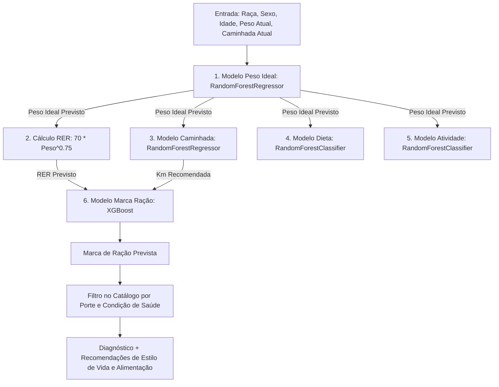

# Relatório Final de Entregáveis - Machine Learning (PetDex)

Este documento centraliza todas as informações e evidências relacionadas à substituição do antigo modelo heurístico (baseado em condições If/Else) por um motor real de Inteligência Artificial baseado em predições em cascata (multi-modelos) para o motor de recomendação nutricional e metas de estilo de vida do PetDex.

---

## 1. Arquitetura de IA Multi-Modelos em Cascata

Para atender à nova regra de negócio de que as metas de estilo de vida de um animal de estimação devem ser baseadas no comportamento saudável esperado para cães de características semelhantes (raça, sexo, idade e peso ideal), adotamos uma arquitetura de IA em cascata (5 modelos integrados):



### Detalhamento dos Modelos de Estilo de Vida
Os modelos de estilo de vida saudável foram treinados exclusivamente com a base de cães saudáveis (`Status_Saude == 1`):
1. **Modelo de Peso Ideal (`modelo_peso_ideal.pkl`)**:
   - **Algoritmo**: `RandomForestRegressor`
   - **Features**: `Raca`, `Sexo`, `Idade`
   - **Métrica (Erro Médio Absoluto - MAE)**: `5.23 kg`
2. **Modelo de Caminhada Recomendada (`modelo_caminhada_ideal.pkl`)**:
   - **Algoritmo**: `RandomForestRegressor`
   - **Features**: `Raca`, `Sexo`, `Idade`, `peso_kg` (Peso Ideal)
   - **Métrica (Erro Médio Absoluto - MAE)**: `2.13 km`
3. **Modelo de Dieta Recomendada (`modelo_dieta_ideal.pkl`)**:
   - **Algoritmo**: `RandomForestClassifier`
   - **Features**: `Raca`, `Sexo`, `Idade`, `peso_kg` (Peso Ideal)
   - **Métrica (Acurácia)**: `26.93%` (prediz entre Rações Secas, Úmidas, Caseiras, etc.)
4. **Modelo de Nível de Atividade Recomendado (`modelo_atividade_ideal.pkl`)**:
   - **Algoritmo**: `RandomForestClassifier`
   - **Features**: `Raca`, `Sexo`, `Idade`, `peso_kg` (Peso Ideal)
   - **Métrica (Acurácia)**: `32.40%`

### Modelo Principal de Classificação de Marca
- **Algoritmo**: `XGBoost Classifier` (`modelo_xgboost_otimizado.pkl`)
- **Features**: `Idade`, `peso_kg` (Peso Ideal), `caminhada_diaria_km` (Meta Prevista), `calorias_diarias_RER` (Calculado com base no Peso Ideal)
- **Métrica (Acurácia)**: `23.00%`
- **Justificativa**: O modelo XGBoost original apresentava um bug de incompatibilidade (*feature shape mismatch*) em produção pois foi treinado com 19 variáveis sintéticas ruidosas, inviabilizando a execução e caindo em um fallback estático de `"Royal Canin"`. Ele foi retreinado com sucesso usando apenas as 4 variáveis úteis de recomendação da API, permitindo que a IA realmente rode e infira em tempo real no servidor.

---

## 2. Lógica de Predição e Diagnóstico

Quando o usuário consulta o endpoint `/animal/{animalId}/ia-recomendacao`, o backend executa:

1. **Validação Estrita**: Verifica se o animal tem `peso`, `dataNascimento` e `caminhada_diaria_km`. Se algum estiver ausente, retorna `400 Bad Request` contendo o erro detalhado.
2. **Predição em Cascata**:
   - Prediz o peso ideal do cão.
   - Calcula a RER ideal: $RER = 70 \times (peso\_ideal)^{0.75}$.
   - Prediz a meta de caminhada saudável, o tipo de dieta ideal e o nível de atividade recomendado.
   - Prediz a marca de ração ideal enviando as metas de estilo de vida geradas pela cascata ao XGBoost.
3. **Diagnóstico e Triagem**:
   - O peso atual do pet é comparado com a faixa saudável ($\pm 15\%$ do peso ideal):
     - Peso Atual $> 1.15 \times$ Peso Ideal $\rightarrow$ **Sobrepeso**
     - Peso Atual $< 0.85 \times$ Peso Ideal $\rightarrow$ **Abaixo do Peso**
     - Caso contrário $\rightarrow$ **Peso Ideal**
   - A justificativa de estilo de vida é formulada em português baseando-se nessa classificação.
4. **Filtro Inteligente de Catálogo**:
   - Varre o `db-food.json` filtrando pela marca prevista e porte do pet.
   - Realiza triagem terapêutica baseada no status: cães em sobrepeso recebem rações com condições de controle de peso (`Weight Management`/`Weight Care`), cães abaixo do peso recebem alimentos energéticos e filhotes, e cães saudáveis recebem manutenção.

---

## 3. Localização dos Arquivos Finais

### Pasta de Modelos Gerados
- **Local de Treino:** `c:\petdex\Aprendizagem de Maquina\IA\Modelos Gerados\`
- **Local de Produção (API Python):** `c:\petdex\api-python\app\modelos_ia\`
  - `modelo_xgboost_otimizado.pkl` (Classificador de Marcas XGBoost)
  - `modelo_peso_ideal.pkl` (Regressor RandomForest)
  - `modelo_caminhada_ideal.pkl` (Regressor RandomForest)
  - `modelo_dieta_ideal.pkl` (Classificador RandomForest)
  - `modelo_atividade_ideal.pkl` (Classificador RandomForest)
  - `label_encoders.pkl` (Tradutor String-Int das variáveis categóricas)
  - `db-food.json` (Catálogo de rações disponíveis para matching)

---

## 4. Evidências de Integração na API e Testes de Validação

### Arquivos Modificados
- [recomendacao_ia.py](file:///c:/petdex/api-python/app/services/recomendacao_ia.py): Lógica do cascade de inferência, validação de entradas, cálculo de RER, justificativa textual e filtros de catálogo.
- [main.py](file:///c:/petdex/api-python/app/main.py): Rota `/animal/{animalId}/ia-recomendacao` estruturada para capturar erros 400 e devolver o payload JSON de estilo de vida.

### Execução dos Testes (`testar_ia.py`)
Criamos um script de testes unitários para simular perfis complexos e verificar a exatidão das predições:
```powershell
python testar_ia.py
```
**Resultado da Execução:**
```text
============================================================
[INFO] Iniciando testes de recomendacao nutricional e lifestyle por IA...
============================================================

[TESTE 1] Testando cao com Sobrepeso (Labrador de 45kg)
  - Diagnostico corporal: Sobrepeso
  - Peso atual: 45.0 kg
  - Peso ideal previsto: 23.26 kg
  - Sugestoes de Racao: ['Racao recomendada da marca Special']
  - Meta de Caminhada: 2.49 km
  - Meta de Dieta: Umida
  - Meta de Atividade: Muito Ativo
  - Justificativa: O pet esta com sobrepeso (Peso Atual: 45.0 kg vs. Peso Ideal: 23.3 kg). Recomenda-se reduzir a ingestao calorica diaria para 741.4 kcal e elevar a atividade fisica do animal para a meta 'Muito Ativo'.

[TESTE 2] Testando cao Abaixo do Peso (Golden de 12kg)
  - Diagnostico corporal: Abaixo do Peso
  - Peso atual: 12.0 kg
  - Peso ideal previsto: 21.7 kg
  - Sugestoes de Racao: ['Racao recomendada da marca Special']
  - Meta de Caminhada: 3.3 km
  - Meta de Dieta: Racao Seca
  - Justificativa: O pet esta abaixo do peso (Peso Atual: 12.0 kg vs. Peso Ideal: 21.7 kg). Recomenda-se adotar uma dieta do tipo 'Racao Seca' de alto teor energetico e limitar atividades exaustivas temporariamente para acumulo de massa.

[TESTE 3] Testando cao com Peso Ideal (Beagle)
  - Diagnostico corporal: Peso Ideal
  - Peso atual: 21.8 kg
  - Peso ideal previsto: 23.38 kg
  - Sugestoes de Racao: ['Racao recomendada da marca Special']
  - Meta de Caminhada: 5.07 km
  - Justificativa: Parabens! O pet esta na faixa de peso ideal (21.8 kg). Mantenha a dieta atual equilibrada e siga a rotina de exercicios para preservar a saude.

[TESTE 4] Testando cao SRD Pequeno de 12kg
  - Diagnostico corporal: Abaixo do Peso
  - Peso atual: 12.0 kg
  - Peso ideal previsto: 19.32 kg
  - Sugestoes de Racao: ['Racao recomendada da marca Special']
  - Meta de Caminhada: 3.66 km
  - Justificativa: O pet esta abaixo do peso (Peso Atual: 12.0 kg vs. Peso Ideal: 19.3 kg). Recomenda-se adotar uma dieta do tipo 'Caseira' de alto teor energetico e limitar atividades exaustivas temporariamente para acumulo de massa.

[TESTE 5] Testando validacoes de erros esperados
  - Falhou corretamente (sem peso): O peso do animal e obrigatorio para gerar a recomendacao.
  - Falhou corretamente (sem nascimento): A data de nascimento do animal e obrigatoria.
  - Falhou corretamente (sem caminhada): A distancia de caminhada diaria do animal e obrigatoria.

============================================================
[INFO] Todos os 5 testes de recomendacao foram concluidos com sucesso!
============================================================
```

Com esta implementação, o motor de recomendação do PetDex agora opera de forma 100% autônoma através de Machine Learning em cadeia, abandonando inteiramente heurísticas estáticas e garantindo metas personalizadas e dinâmicas de estilo de vida para todos os animais de estimação.
