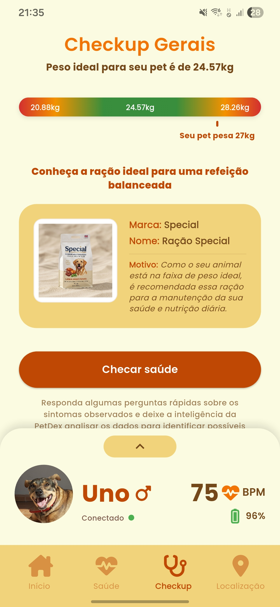
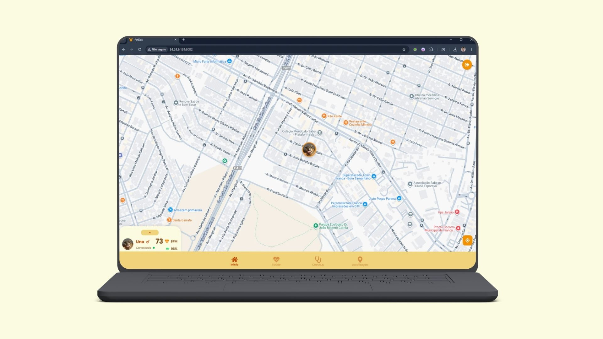

<p align="center">
  
</p>

# 🐾 PetDex

Repositório do **Grupo 07** do Projeto Interdisciplinar do **5º semestre** do curso de **Desenvolvimento de Software Multiplataforma - DSM** (Turma 2025/2).

---

## 🎬 Veja o vídeo do projeto

<p align="center">
  <a href="https://www.youtube.com/watch?v=9IwRMAMUHo0">
    
  </a>
</p>

📺 [Clique aqui para assistir ao vídeo](https://www.youtube.com/watch?v=9IwRMAMUHo0)

---

## 👨‍💻 Integrantes

- **Felipe Avelino Pedaes**  
- **Gabriel Resende Spirlandelli**  
- **Henrique Almeida Florentino**  
- **Luiz Felipe Vieira Soares**

---

## 🔗 Acesso ao Projeto

* **🎨 FIGMA:** [Protótipo da Interface](https://www.figma.com/design/BZOrhXmiYHgesIZf1Ex3Pw/PetDex.?node-id=0-1&t=8nuIhASiCYaiae4f-1)
* **🐍 API de Análise (FastAPI - Python):** [http://34.24.9.134:8083/docs](http://34.24.9.134:8083/docs)
* **☕ API Principal (Java - Spring Boot):** [http://34.24.9.134:8080/swagger](http://34.24.9.134:8080/swagger)
* **💻 Versão Web (Next.js):** [http://34.24.9.134:8082/](http://34.24.9.134:8082/)
* **📱 Download do APK (Android):** [Baixar PetDex APK](https://drive.google.com/file/d/1qfmFwAp55BwcIVp8BA7cER1gD2TSqYkW/view?usp=sharing)

### **🔑 Credenciais de Teste**

Para testar a plataforma, utilize as seguintes credenciais:

```json
{
  "email": "henriquealmeidaflorentino@gmail.com",
  "senha": "senha123"
}
```

### **⚠️ Limitação Atual - Usuário de Teste**

**AVISO IMPORTANTE:** No momento, quando um novo usuário é cadastrado e um animal também é cadastrado, o aplicativo **não carregará corretamente** devido à falta de conexão com a coleira física.

**Por que essa limitação existe?**

O aplicativo depende de dados enviados pela coleira física (batimentos cardíacos, localização GPS, movimento). Sem uma coleira conectada ao animal cadastrado, o aplicativo não receberá dados e não funcionará corretamente.

**Solução para Testes:**

Utilize as credenciais acima (`henriquealmeidaflorentino@gmail.com` / `senha123`) que já possuem um animal cadastrado e conectado à coleira, permitindo acesso completo a todas as funcionalidades com dados reais.

---

## 📖 Sobre o Projeto

O **PetDex** é uma solução **IoT + Mobile + IA** desenvolvida para o **monitoramento em tempo real da saúde e segurança de cães e gatos**.

A plataforma combina uma **coleira inteligente** equipada com sensores de batimentos cardíacos, movimentação e localização GPS com um **aplicativo móvel multiplataforma**, permitindo que o tutor acompanhe o bem-estar do animal 24h por dia.

<p align="center">
  
</p>

<p align="center">
  
  
</p>

O sistema coleta dados em tempo real e envia para o backend em nuvem, que processa e analisa essas informações com **inteligência artificial** para detectar alterações fisiológicas, prevenir doenças e notificar o tutor em caso de risco ou fuga.

A solução visa **prevenção, segurança e cuidado contínuo**, fortalecendo o vínculo entre humanos e seus pets.

---

## 📱 Nossa Plataforma

O **aplicativo PetDex**, desenvolvido em **Flutter**, entrega uma experiência completa e intuitiva para acompanhar a rotina do animal.

### **Principais Funcionalidades**

<p align="center">
  
</p>
<p align="center">
  <em><b>Tela Inicial:</b> mostra a última localização e o batimento cardíaco mais recente do pet, além de um gráfico com as médias das últimas horas.</em>
</p>

---

<p align="center">
  
</p>
<p align="center">
  <em><b>Tela de Saúde:</b> exibe a média de batimentos diários, por data e análises estatísticas referente ao último batimento registrado.</em>
</p>

---

<p align="center">
  
</p>
<p align="center">
  <em><b>Tela Checkup Inteligente:</b> o tutor responde sintomas observados, e a IA da PetDex sugere possíveis condições com base nos dados coletados mas sem emitir diagnósticos, apenas orientações preventivas.</em>
</p>

---

<p align="center">
  
</p>
<p align="center">
  <em><b>Tela de Localização: </b> mostra o mapa em tempo real e permite configurar uma <b>área segura</b>. O app envia alertas automáticos caso o pet saia ou retorne ao perímetro.</em>
</p>

---

<p align="center">
  
</p>
<p align="center">
  <em><b>Tela de Análise de Peso e Recomendação:</b> análise de peso e recomendação de ração para auxiliar no controle de peso e na dieta do animal.</em>
</p>

---

### **Versão Web**

A plataforma também conta com um painel administrativo e de usuário **desenvolvido em Next.js**, permitindo o acesso prático e detalhado às informações do pet diretamente pelo navegador.

<p align="center">
  
</p>
<p align="center">
  <em><b>Dashboard Web:</b> interface web do PetDex, permitindo monitoramento contínuo com gráficos em tempo real.</em>
</p>

---

## 🧠 Arquitetura da Solução

A PetDex foi desenvolvida com uma **arquitetura modular e distribuída**, dividida em três pilares:

### **1️⃣ Hardware (IoT) – Coleira Inteligente**

* **Microcontrolador:** ESP32 S3 Zero (Wi-Fi e Bluetooth)
* **Sensores:**
  - GY-MAX30102 → Batimentos cardíacos e oxigenação do sangue  
  - MPU6050 → Movimento e postura  
  - NEO-6M → Localização GPS  
* **Prototipagem:** Case em **impressão 3D (PLA)**, leve e ergonômico
* **Testes práticos:** realizados com o cão **Uno**, confirmando conforto e adaptação

---

### **📡 Mensageria e Funcionamento da Coleira**

A coleira inteligente atua como a principal fonte de dados para todo o sistema, coletando métricas dos sensores (batimentos cardíacos, movimentação e localização GPS) de forma contínua. 
O fluxo de envio de dados e comunicação funciona da seguinte maneira:
- O microcontrolador (ESP32) coleta e transmite os dados gerados pela coleira para a nuvem utilizando o **Google Pub/Sub**.
- O **Google Pub/Sub** atua como o serviço central de mensageria, recebendo os dados da coleira de forma escalável e enviando-os para a nossa API Principal para serem cadastrados e processados.
- Após o salvamento, a API retransmite esses eventos instantaneamente para todos os clientes conectados (App Mobile e Dashboard Web) através de uma conexão **WebSocket**.
- Esse modelo arquitetural garante que o tutor monitore as métricas de saúde e a posição no mapa de forma contínua, **sem a necessidade de recarregar a tela**, aliando a robustez do Google Pub/Sub para a ingestão dos dados IoT com a baixa latência do WebSocket para o usuário final.

---

### **2️⃣ Backend e Infraestrutura**

* **API Principal:** Java 21 + Spring Boot
  - Padrão **Domain-Driven Design (DDD)**
  - Persistência com **MongoDB** (séries temporais)
  - Documentação com **Swagger/OpenAPI**
  - Autenticação via **JWT (JSON Web Tokens)**

* **API Analítica:** Python 3.11 + FastAPI
  - Processamento estatístico e aprendizado de máquina
  - Bibliotecas: Pandas, NumPy, SciPy, Scikit-learn
  - Modelo preditivo **KNN (K-Nearest Neighbors)** em formato `.pkl`
  - Execução assíncrona com **Uvicorn**
  
  **📊 Análises Avançadas:**
  Esta API fornece endpoints que processam e interpretam os dados recebidos, incluindo:
  - Estatísticas descritivas (média, moda, mediana, desvio padrão)
  - Correlações entre movimento e batimentos cardíacos
  - Avaliação de peso ideal e recomendação nutricional via KNN
  - Status geral de saúde e alertas de anomalias
  
  *Esses resultados alimentam os dashboards da plataforma, oferecendo uma visão clara e personalizada da condição do pet.*

* **Hospedagem:** Servidor Google Cloud
  - Sistema Operacional: **Ubuntu**
  - Tipo de Máquina: **e2-medium (2 vCPUs, 4 GB de memória)**
  - APIs acessíveis via IP público

* **Containerização e Orquestração:**
  - **Docker**: Cada API é containerizada em sua própria imagem Docker
  - **Docker Compose**: Orquestração de múltiplos containers (API Java, API Python)
  - Rede interna (`petdex-network`) para comunicação entre containers
  - Volumes persistentes para armazenamento de dados

---

## 🚀 Infraestrutura e Deploy

### **☁️ Hospedagem na Google Cloud**

O projeto PetDex está hospedado na **Google Cloud**, utilizando uma máquina virtual com as seguintes especificações:

- **Sistema Operacional:** Ubuntu Server
- **Tipo de Máquina:** e2-medium (2 vCPUs, 4 GB de memória)
- **IP Público:** 34.24.9.134
- **Região:** East US

### **🐳 Containerização com Docker**

Toda a infraestrutura backend é containerizada usando **Docker**, garantindo:

- **Portabilidade:** Mesma configuração em desenvolvimento e produção
- **Isolamento:** Cada serviço roda em seu próprio container
- **Escalabilidade:** Fácil replicação e balanceamento de carga
- **Consistência:** Ambiente idêntico em qualquer máquina

**Estrutura de Containers:**

```yaml
services:
  api-java:
    - Porta: 8080
    - Imagem: petdex/api-java:main
    - Rede: petdex-network

  api-python:
    - Porta: 8083
    - Imagem: petdex/api-python:main
    - Rede: petdex-network
```

### **🔄 Orquestração com Docker Compose**

O **Docker Compose** gerencia múltiplos containers e suas dependências:

- **Rede Interna:** Containers se comunicam através da rede `petdex-network`
- **Variáveis de Ambiente:** Configurações sensíveis (JWT_SECRET, DATABASE_URI) via `.env`
- **Restart Automático:** Containers reiniciam automaticamente em caso de falha
- **Volumes Persistentes:** Dados importantes são mantidos mesmo após restart

**Como executar localmente com Docker Compose:**

```bash
# Clone o repositório
git clone https://github.com/FatecFranca/DSM-P4-G07-2025-1.git
cd DSM-P4-G07-2025-1

# Configure o arquivo .env
cp .env.example .env

# Inicie todos os serviços
docker-compose up -d

# Visualize os logs
docker-compose logs -f

# Pare todos os serviços
docker-compose down
```

### **⚙️ CI/CD - Deploy Automático**

O projeto implementa um pipeline de **CI/CD (Continuous Integration/Continuous Deployment)** para automatizar o processo de deploy:

**Fluxo de Deploy:**

1. **Commit/Push:** Desenvolvedor faz push para o repositório GitHub
2. **Build Automático:** GitHub Actions detecta mudanças e inicia o build
3. **Criação de Imagens Docker:** Novas imagens são construídas automaticamente
4. **Push para Registry:** Imagens são enviadas para o Docker Hub/Registry
5. **Deploy no Servidor:** Servidor GCP puxa as novas imagens e reinicia os containers
6. **Verificação:** Health checks garantem que os serviços estão funcionando

**Benefícios:**

- ✅ Deploy rápido e confiável
- ✅ Redução de erros humanos
- ✅ Rollback fácil em caso de problemas
- ✅ Histórico completo de deploys

### **📡 Informações do Servidor**

**IP do Servidor Google Cloud:** `34.24.9.134`

**Endpoints das APIs:**

| Serviço | URL Base | Documentação | Porta |
|:--------|:---------|:-------------|:------|
| **API Java** | `http://34.24.9.134:8080` | [Swagger](http://34.24.9.134:8080/swagger) | 8080 |
| **API Python** | `http://34.24.9.134:8083` | [Docs](http://34.24.9.134:8083/docs) | 8083 |
| **WebSocket** | `ws://34.24.9.134:8080/ws-petdex` | - | 8080 |

**Rotas Principais:**

**API Java (Spring Boot):**
- `POST /auth/login` - Autenticação de usuários
- `GET /animais/{id}` - Consultar dados do animal
- `GET /batimentos/animal/{id}` - Histórico de batimentos cardíacos
- `GET /localizacoes/animal/{id}` - Histórico de localizações
- `WS /ws-petdex` - Conexão WebSocket para dados em tempo real

**API Python (FastAPI):**
- `GET /batimentos/estatisticas` - Estatísticas de batimentos
- `GET /batimentos/media-ultimos-5-dias` - Média diária dos últimos 5 dias
- `GET /batimentos/probabilidade?valor=XX` - Probabilidade de um batimento
- `GET /batimentos/regressao` - Análise de regressão linear
- `GET /health` - Status da API

---

### **3️⃣ Aplicativo Mobile**

* **Framework:** Flutter  
* **Recursos:**  
  - Monitoramento em tempo real  
  - Dashboards de saúde  
  - Checkup inteligente com IA  
  - Notificações e alertas de fuga  
  - Mapa interativo (Google Maps API)

---

## 🔐 Sistema de Autenticação JWT

A PetDex implementa um sistema robusto de autenticação baseado em **JWT (JSON Web Tokens)** para garantir a segurança das comunicações entre os componentes da plataforma.

### **Como Funciona**

1. **Login do Usuário:** O usuário realiza login através do aplicativo mobile, enviando suas credenciais para a API Java
2. **Geração do Token:** A API Java valida as credenciais e gera um token JWT assinado
3. **Propagação do Token:** O token é armazenado no aplicativo e enviado em todas as requisições subsequentes
4. **Fluxo de Autenticação:** Cliente → API Python → API Java
   - O aplicativo mobile envia o token JWT para a API Python
   - A API Python valida e propaga o token para a API Java
   - A API Java valida o token e processa a requisição

### **Configuração**

Ambas as APIs (Java e Python) compartilham a mesma chave secreta JWT (`JWT_SECRET`) configurada nos arquivos `.env`, garantindo que os tokens possam ser validados em toda a infraestrutura.

---

## 🧠 Modelo de Inteligência Artificial

A PetDex utiliza um modelo de **análise de peso ideal e recomendação nutricional** treinado com técnicas de aprendizado de máquina para analisar o perfil do animal, avaliar seu estado corporal e sugerir a ração mais adequada para o seu bem-estar.

### **Base de Dados: Canine Wellness Dataset**

Para o treinamento do modelo, foi utilizada a base de dados **[Canine Wellness Dataset (Synthetic 10k Samples)](https://www.kaggle.com/datasets/aaronisomaisom3/canine-wellness-dataset-synthetic-10k-samples)**, disponível no Kaggle. Esta base conta com dados simulados de **10.000 cachorros**, contendo informações sobre idade, peso e nível de atividade física, o que permitiu a criação de um modelo focado nas necessidades reais de cada perfil de animal.

### **Variáveis Analisadas (Features)**

O principal objetivo da Inteligência Artificial é prever a melhor categoria e marca de ração com base nas características individuais. O algoritmo recebe como entrada (features):
- **Idade (Age)**
- **Peso Ideal e Real (Weight em kg)**
- **Nível de Atividade (Caminhada diária em km)**
- **Necessidade de Energia em Repouso (RER - Calorias diárias calculadas a partir do peso)**

### **Seleção do Modelo: K-Nearest Neighbors (KNN)**

Após a etapa de treinamento e validação, o algoritmo **K-Nearest Neighbors (KNN)** foi selecionado como o modelo oficial para a recomendação de ração.
- O modelo treinado foi salvo e exportado (`modelo_knn_racao.pkl`) utilizando a biblioteca `joblib` para o Python.
- Além do KNN, a API implementa uma lógica de **Avaliação de Peso**, que compara o peso real com o ideal para identificar se o pet está **Abaixo do Peso**, no **Peso Ideal** ou em **Sobrepeso**.
- Cruzando a predição do KNN com a avaliação de peso, o sistema filtra um catálogo interno validado nutricionalmente (`db-food.json`) e devolve opções reais de rações para controle de dieta.

Essa inteligência está hospedada na **API Analítica (Python/FastAPI)**, e as recomendações geradas auxiliam ativamente os tutores nas decisões sobre a nutrição diária de seus cães.

---

## 🧩 Tecnologias Utilizadas

| Camada | Tecnologias |
|:-------|:-------------|
| **Hardware (IoT)** | ESP32 S3 Zero, GY-MAX30102, MPU6050, NEO-6M, Impressão 3D (PLA) |
| **Backend** | Java + Spring Boot, MongoDB, Swagger, JWT, FastAPI (Python), Scikit-learn, PMML |
| **Frontend** | Flutter, API Google Maps |
| **Infraestrutura** | GCP (Ubuntu, Standard B1ms), arquitetura de microsserviços |

---

## 🧪 Resultados

- Integração completa entre **coleira, backend e app**
- Transmissão e análise de dados em tempo real
- Teste físico com pet real validou **ergonomia e conforto**
- Modelo preditivo funcional de frequência cardíaca
- Base pronta para futuras versões com **IA classificadora** e **telemedicina veterinária**

---

> Projeto desenvolvido como parte das atividades acadêmicas da **FATEC** – Faculdade de Tecnologia.  
> Orientado pelos princípios de inovação, prevenção e bem-estar animal 🐕💙

