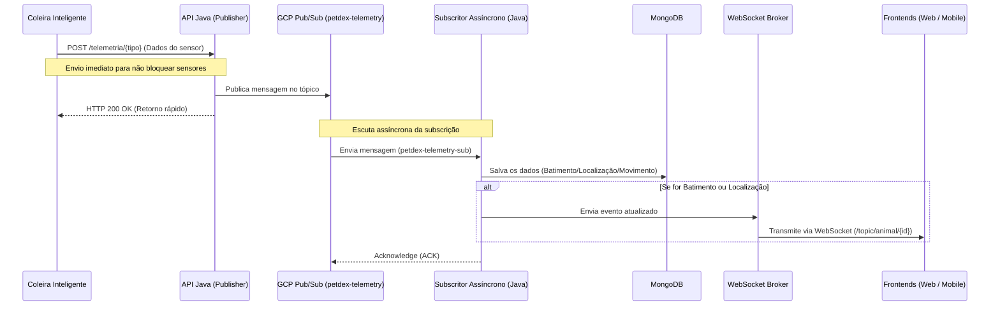

<p align="center">
  
</p>

# 🧠 API em Java — Coleira Inteligente

Esta é a API RESTful desenvolvida com **Java** e **Spring Boot**, responsável por receber os dados de telemetria enviados pela coleira inteligente, realizar o cadastro de usuários e animais no banco de dados, gerenciar áreas seguras e disparar notificações em tempo real via **WebSocket** para as interfaces frontend (Mobile e Web).

---

## ⚙️ Tecnologias Utilizadas

- **Java 21**
- **Spring Boot**
- **Google Cloud Pub/Sub** (Mensageria assíncrona para alta vazão de telemetria)
- **MongoDB** (Banco de dados NoSQL de alta performance para armazenamento de telemetria)
- **JWT (JSON Web Tokens)** (Autenticação distribuída e Segurança)
- **WebSocket + STOMP** (Comunicação bidirecional e eventos em tempo real)
- **SockJS** (Fallback para navegadores/clientes sem suporte WebSocket nativo)
- **Swagger/OpenAPI 3.0** (Documentação interativa de endpoints)
- **Google Cloud Platform** (Infraestrutura de hospedagem)
- **Lombok** (Produtividade no código Java)
- **JUnit & Mockito** (Testes unitários e de integração)

---

## 🚀 Infraestrutura de Hospedagem


A API está hospedada em um servidor **Google Cloud** com as seguintes especificações:

- **Sistema Operacional:** Ubuntu
- **Tipo de Máquina:** Standard B1ms
- **IP Público:** 34.24.9.134
- **Porta:** 8080

Esta infraestrutura garante alta disponibilidade e performance para o processamento dos dados da coleira inteligente em tempo real.


🔗 **API Base:** [http://34.24.9.134:8080](http://34.24.9.134:8080)

A documentação interativa da API, feita com Swagger (OpenAPI), está disponível em:

📘 **Swagger UI:** [http://34.24.9.134:8080/swagger](http://34.24.9.134:8080/swagger)

### **🔑 Credenciais de Teste**

Para testar os endpoints protegidos, utilize as seguintes credenciais:

```json
{
  "email": "henriquealmeidaflorentino@gmail.com",
  "senha": "senha123"
}
```

**Como testar no Swagger:**

1. Acesse o endpoint de login (`POST /auth/login`)
2. Use as credenciais acima no corpo da requisição
3. Copie o token JWT retornado
4. Clique no botão **"Authorize"** (cadeado) no topo da página
5. Cole o token e clique em **"Authorize"**
6. Agora você pode testar todos os endpoints protegidos

---

## 📣 Arquitetura de Mensageria Pub/Sub (Google Cloud Pub/Sub)

Para garantir que a **Coleira Inteligente** consiga transmitir dados de sensores com alta frequência sem sofrer atrasos ou bloqueios causados por operações de persistência no banco de dados, a API utiliza uma arquitetura baseada em eventos com o **Google Cloud Pub/Sub**.

### 🔄 Fluxo de Processamento de Telemetria



1. **Ingestão Ultrarrápida (Publishing)**: A coleira inteligente faz uma requisição HTTP `POST` para os endpoints de `/telemetria/*`. A API converte o payload em JSON e o publica imediatamente no tópico `petdex-telemetry` da GCP, retornando `HTTP 200 OK` de forma instantânea. Isso libera a CPU do dispositivo embarcado da coleira para realizar novas leituras de sensores sem aguardar a gravação em disco.
2. **Processamento em Segundo Plano (Subscribing)**: A classe `TelemetrySubscriberAsyncPubSub` roda continuamente em segundo plano consumindo mensagens da subscrição `petdex-telemetry-sub` na GCP de forma desacoplada.
3. **Roteamento & Validação**: O `TelemetrySubscriberService` interpreta a mensagem JSON, identifica o tipo de telemetria (`heart_rate`, `location` ou `movement`) utilizando a enum `TelemetryTypeEnum` e delega aos serviços de negócio específicos.
4. **Persistência & Atualização Real-Time**: Os serviços salvam os dados no MongoDB. Ao persistir dados de **localização** e **batimentos cardíacos**, a API invoca o `NotificationService` para transmitir esses novos dados via **WebSocket** em tempo real para os aplicativos mobile e web conectados.

### 📋 Schemas de Mensagens JSON (Pub/Sub)

Ao publicar no tópico `petdex-telemetry`, as mensagens devem seguir a estrutura definida pelas DTOs correspondentes ao campo `type`:

#### 1. Batimento Cardíaco (`heart_rate`)
Utiliza a classe `BatimentoPublisherDTO`:
```json
{
  "type": "heart_rate",
  "data": "2026-05-30T14:30:00.000+00:00",
  "frequenciaMedia": 75,
  "animal": "507f1f77bcf86cd799439011",
  "coleira": "507f1f77bcf86cd799439011"
}
```

#### 2. Localização (`location`)
Utiliza a classe `LocalizacaoPublisherDTO`:
```json
{
  "type": "location",
  "data": "2026-05-30T14:30:00.000+00:00",
  "latitude": -23.550520,
  "longitude": -46.633308,
  "animal": "507f1f77bcf86cd799439011",
  "coleira": "507f1f77bcf86cd799439011"
}
```

#### 3. Movimento (`movement`)
Utiliza a classe `MovimentoPublisherDTO`:
```json
{
  "type": "movement",
  "data": "2026-05-30T14:30:00.000+00:00",
  "acelerometroX": 0.5,
  "acelerometroY": 0.3,
  "acelerometroZ": 9.8,
  "giroscopioX": 0.1,
  "giroscopioY": 0.2,
  "giroscopioZ": 0.05,
  "animal": "507f1f77bcf86cd799439011",
  "coleira": "507f1f77bcf86cd799439011"
}
```

---


## 🔌 Comunicação em Tempo Real via WebSocket

Para manter as telas do **Frontend Web (Next.js)** e do **Aplicativo Mobile (Flutter)** atualizadas instantaneamente assim que a telemetria é processada pelo Pub/Sub, a API Java implementa **WebSockets com o protocolo STOMP**.

### 🔄 Fluxo de Notificação

1. Quando o subscritor do Pub/Sub recebe e valida uma mensagem de telemetria, ela é salva no MongoDB.
2. Imediatamente após salvar, o `WebSocketNotificationAdapter` transmite o dado para o broker de mensagens do Spring.
3. O broker direciona a mensagem para o canal correspondente ao ID do animal monitorado.
4. Qualquer cliente autenticado (Web ou Mobile) que esteja escutando o canal recebe instantaneamente o payload JSON.

### 🔗 Endpoint e Protocolos

* **Endpoint de Conexão**: `ws://localhost:8080/ws-petdex` (ou `ws://34.24.9.134:8080/ws-petdex` em produção)
* **Autenticação**: O token JWT deve ser fornecido via cabeçalho HTTP de handshake (`Authorization: Bearer <token>`) ou como query parameter `?token=<token>`.
* **Protocolos**: STOMP por cima do WebSocket, com suporte a **SockJS** para conexões legadas.

### 📣 Tópicos de Assinatura (Subscription Channels)

Os clientes (Web/Mobile) devem se inscrever em tópicos específicos para monitoramento em tempo real:

| Tópico | Descrição | Dados Transmitidos |
|:-------|:----------|:-------------------|
| `/topic/animal/{animalId}` | Escuta as telemetrias em tempo real de um pet específico | Localização (latitude/longitude) e Batimentos Cardíacos (BPM) |

---


## 📐 Arquitetura DDD (Domain-Driven Design)

A API foi desenvolvida seguindo os princípios de **Domain-Driven Design (DDD)**, visando manter o domínio de negócios limpo, desacoplado de dependências tecnológicas e facilmente testável.

A estrutura de pacotes do projeto é organizada em quatro camadas principais:

```
src/main/java/com/petdex/api/
├── domain/                  # Camada de Domínio (Core do Negócio)
│   └── collections/         # Entidades de domínio (Mapeadas para o MongoDB)
├── application/             # Camada de Aplicação (Orquestração e Casos de Uso)
│   ├── contracts/           # DTOs, Enums e Interfaces de Notificação
│   └── services/            # Serviços de aplicação contendo regras de negócio
├── infrastructure/          # Camada de Infraestrutura (Detalhes de Tecnologia)
│   ├── config/              # Configurações do Spring e WebSocket
│   ├── mongodb/             # Repositórios do Spring Data MongoDB (Persistência)
│   ├── messaging/           # Implementação concreta dos Adaptadores Pub/Sub GCP
│   ├── security/            # Filtros JWT e configurações de criptografia
│   └── websocket/           # Emissor físico das mensagens WebSocket
└── view/                    # Camada de Apresentação (Interface Externa)
    └── *Controllers.java   # Controladores REST HTTP expostos aos clientes
```

### 🧱 Detalhe das Camadas

* **Domínio (`domain`)**: Contém as entidades ricas do sistema como `Animal`, `AreaSegura`, `Usuario`, `Coleira`, `Batimento`, `Localizacao` e `Movimento`. Elas encapsulam o estado e o comportamento principal do modelo de dados.
* **Aplicação (`application`)**:
  * **Contracts**: Define DTOs separadas para entrada (`ReqDTO`), saída (`ResDTO`) e filas (`PublisherDTO`), enums como `TelemetryTypeEnum` e interfaces como `NotificationService`.
  * **Services**: Implementa o fluxo de controle de cadastros, atualizações e validações. Não conhece os endpoints HTTP e interage com persistência e mensageria apenas por interfaces abstratas.
* **Infraestrutura (`infrastructure`)**: Contém adaptadores tecnológicos que dão suporte à aplicação, incluindo bibliotecas da Google Cloud para o Pub/Sub, segurança com JWT e a integração com o banco MongoDB.
* **Visão (`view`)**: Controladores REST. Lida com protocolos de comunicação externa, validações básicas do payload (`@Valid`), cabeçalhos de resposta HTTP e anotações OpenAPI (Swagger).

---

## 🔐 Sistema de Autenticação JWT

A API implementa autenticação baseada em **JWT (JSON Web Tokens)** para garantir a segurança das comunicações.

### **Como Funciona**

1. **Login:** O usuário envia suas credenciais (email e senha) para o endpoint `/auth/login`.
2. **Geração do Token:** A API valida as credenciais no banco de dados e gera um token JWT assinado.
3. **Uso do Token:** O token deve ser incluído no header `Authorization: Bearer <token>` em todas as requisições protegidas.
4. **Validação:** A API valida o token em cada requisição, verificando sua assinatura e expiração.

### **Fluxo de Tokens**

A arquitetura da PetDex implementa um fluxo de autenticação em cascata:

```
Cliente (Mobile/Web) → API Python → API Java
```

- O aplicativo mobile e o portal web obtêm o token JWT através do login na API Java.
- Quando o frontend faz requisições para a API Python, envia o token JWT.
- A API Python valida e propaga o token para a API Java.
- A API Java valida o token e processa a requisição.

Isso garante que a autenticação seja mantida em toda a cadeia de comunicação, sem necessidade de múltiplos logins.

### **Configuração do JWT_SECRET**

⚠️ **IMPORTANTE:** A chave secreta JWT (`JWT_SECRET`) é essencial para o funcionamento do sistema de autenticação.

**Como configurar:**

1. Crie um arquivo `.env` na raiz do projeto (se ainda não existir)
2. Adicione a variável `JWT_SECRET` com uma chave secreta forte:

```env
JWT_SECRET=sua_chave_secreta_aqui_deve_ser_longa_e_complexa
```

**⚙️ Requisitos Importantes:**

- A chave deve ser **idêntica** à configurada na API Python para garantir compatibilidade de autenticação
- Use uma chave forte e complexa (recomendado: mínimo 32 caracteres)
- **NUNCA** compartilhe ou versione o arquivo `.env` com a chave real
- Para referência, consulte o arquivo `.env.example` no projeto

**Por que isso é necessário?**

O `JWT_SECRET` é usado para assinar e validar os tokens JWT. Como a arquitetura da PetDex implementa um fluxo de autenticação em cascata (Cliente → API Python → API Java), ambas as APIs precisam compartilhar a mesma chave secreta para que os tokens gerados pela API Java possam ser validados pela API Python e vice-versa.

---

## 🧩 Banco de Dados

Utilizamos o **MongoDB** como banco de dados pela sua alta disponibilidade, flexibilidade na estrutura de dados e facilidade de escalabilidade. Como se trata de um projeto com dados variáveis (ex.: batimentos cardíacos, localização, movimentação), um banco NoSQL foi a melhor escolha.

---

## 📡 Recursos e Endpoints da API

A API oferece uma gama completa de recursos para gerenciar o ecossistema da coleira inteligente PetDex. Todos os endpoints abaixo (exceto `/auth/login` e `/health`) exigem autenticação JWT no cabeçalho: `Authorization: Bearer <seu_token_jwt>`.

### 1. Autenticação e Segurança (`/auth`)
* `POST /auth/login`: Autentica o usuário no sistema e retorna o token JWT assinado.

### 2. Gestão de Usuários (`/usuario`)
* `GET /usuario`: Lista todos os usuários cadastrados.
* `GET /usuario/{id}`: Busca um usuário pelo ID único.
* `POST /usuario`: Cadastra um novo usuário no sistema.
* `PUT /usuario/{id}`: Atualiza os dados de um usuário existente.
* `DELETE /usuario/{id}`: Exclui um usuário do sistema.

### 3. Gestão de Animais (`/animal`)
* `GET /animal`: Lista todos os pets cadastrados.
* `GET /animal/{id}`: Detalha informações de um animal por ID.
* `GET /animal/usuario/{usuarioId}`: Lista todos os animais que pertencem a um tutor específico.
* `POST /animal`: Cadastra um animal (vinculando raça, espécie e tutor).
* `PUT /animal/{id}`: Atualiza informações cadastrais do animal.
* `DELETE /animal/{id}`: Remove o animal.

### 4. Áreas Seguras e Cerca Virtual (`/areas-seguras`)
* `POST /areas-seguras`: Cria ou atualiza a cerca virtual do pet (Latitude, Longitude e Raio em metros).
* `GET /areas-seguras/{id}`: Consulta uma área segura pelo seu ID.
* `GET /areas-seguras/animal/{animalId}`: Retorna a cerca virtual configurada para um animal específico.
* `DELETE /areas-seguras/animal/{animalId}`: Remove a cerca virtual configurada do animal.

### 5. Coleiras Inteligentes (`/coleira`)
* `GET /coleira`: Lista todas as coleiras registradas no sistema.
* `GET /coleira/{id}`: Detalha uma coleira por ID.
* `POST /coleira`: Cadastra uma nova coleira inteligente.
* `PUT /coleira/{id}`: Atualiza o status/dados da coleira.
* `DELETE /coleira/{id}`: Remove o dispositivo do sistema.

### 6. Catálogo de Espécies (`/especie`)
* `GET /especie`: Lista as espécies registradas (ex: Cão, Gato).
* `GET /especie/{id}`: Detalha uma espécie específica.
* `POST /especie`: Cadastra uma nova espécie.
* `PUT /especie/{id}`: Atualiza dados da espécie.
* `DELETE /especie/{id}`: Remove uma espécie.

### 7. Catálogo de Raças (`/raca`)
* `GET /raca`: Lista todas as raças de animais disponíveis.
* `GET /raca/{id}`: Detalha uma raça específica.
* `GET /raca/especie/{idEspecie}`: Filtra raças pertencentes a uma espécie específica.
* `POST /raca`: Cadastra uma nova raça.
* `PUT /raca/{id}`: Atualiza dados da raça.
* `DELETE /raca/{id}`: Exclui uma raça do catálogo.

### 8. Históricos de Telemetria (Dashboards e Relatórios)
Esses endpoints retornam os dados consolidados e persistidos no banco de dados para a montagem de históricos e gráficos nas interfaces web e mobile:
* **Batimentos Cardíacos (`/batimento`)**:
  * `GET /batimento/{idBatimento}`: Detalha um registro específico de batimento.
  * `GET /batimento/animal/{idAnimal}`: Lista o histórico de batimentos cardíacos de um animal.
  * `GET /batimento/coleira/{idColeira}`: Lista batimentos capturados por uma coleira específica.
  * `GET /batimento/animal/{idAnimal}/ultimo`: Obtém o último batimento registrado do pet.
  * `POST /batimento`: Insere manualmente um dado de batimento.
* **Localização (`/localizacao`)**:
  * `GET /localizacao/{idLocalizacao}`: Detalha um registro de coordenada.
  * `GET /localizacao/animal/{idAnimal}`: Histórico de posições geográficas do animal.
  * `GET /localizacao/coleira/{idColeira}`: Coordenadas capturadas por uma coleira específica.
  * `GET /localizacao/animal/{idAnimal}/ultima`: Obtém a última coordenada geográfica conhecida do pet.
  * `POST /localizacao`: Insere manualmente um ponto de coordenada.
* **Movimentação do Sensor (`/movimento`)**:
  * `GET /movimento/{idMovimento}`: Detalha leituras de movimento específicas.
  * `GET /movimento/animal/{idAnimal}`: Histórico de leituras do acelerômetro e giroscópio do animal.
  * `GET /movimento/coleira/{idColeira}`: Leituras capturadas por uma coleira.
  * `POST /movimento`: Insere manualmente leituras de aceleração e rotação.

### 9. Interface de Telemetria da Coleira Inteligente (`/telemetria`)
Estes são os endpoints de alto desempenho expostos para a ingestão rápida de dados em tempo de execução pela coleira:
* `POST /telemetria/batimento`: Envia dados de frequência cardíaca diretamente ao Pub/Sub.
* `POST /telemetria/localizacao`: Envia dados de coordenadas (latitude/longitude) diretamente ao Pub/Sub.
* `POST /telemetria/movimento`: Envia dados de aceleração e giroscópio diretamente ao Pub/Sub.

### 10. Status da API (`/health`)
* `GET /health` ou `GET /`: Retorna o status de integridade do servidor.

---

## 📁 Como Executar Localmente

### **📋 Pré-requisitos**

Antes de executar a API Java, certifique-se de ter instalado:

* **Java 21** ou superior
  - [Download do OpenJDK 21](https://adoptium.net/)
  - Verifique a instalação: `java -version`
* **Maven 3.8+** (ou use o Maven Wrapper incluído no projeto)
  - [Download do Maven](https://maven.apache.org/download.cgi)
  - Verifique a instalação: `mvn -version`
* **MongoDB** (local ou acesso a uma instância remota)
  - [Download do MongoDB Community](https://www.mongodb.com/try/download/community)
* **Git** para clonar o repositório

### **🚀 Passos para Execução**

**1. Clone o repositório:**

```bash
git clone https://github.com/FatecFranca/DSM-P4-G07-2025-1.git
cd DSM-P4-G07-2025-1/api-java
```

**2. Configure as credenciais da Google Cloud (Pub/Sub):**

A API necessita de acesso a uma conta de serviço GCP com permissões para interagir com o GCP Pub/Sub.

1. Baixe o arquivo JSON com a chave da conta de serviço da GCP.
2. Salve este arquivo na raiz do projeto `api-java` com o nome `google-cloud-key.json`.

**3. Configure as variáveis de ambiente:**

Crie um arquivo `.env` na raiz do projeto (copie do `.env.example`):

```bash
cp .env.example .env
```

Edite o arquivo `.env` e configure as seguintes variáveis:

```env
# Chave secreta JWT (deve ser idêntica à da API Python)
JWT_SECRET=sua_chave_secreta_aqui_deve_ser_longa_e_complexa

# Configuração do MongoDB
DATABASE_URI=mongodb://localhost:27017/petdex
MONGODB_DATABASE=petdex

# Configurações de Mensageria GCP Pub/Sub
GCP_CREDENTIALS=file:./google-cloud-key.json

# Porta da aplicação (padrão: 8080)
SERVER_PORT=8080
```

**4. Instale as dependências:**

```bash
# Usando Maven Wrapper (recomendado)
./mvnw clean install

# Ou usando Maven instalado globalmente
mvn clean install
```

**5. Execute a aplicação:**

```bash
# Usando Maven Wrapper
./mvnw spring-boot:run

# Ou usando Maven instalado globalmente
mvn spring-boot:run
```

**6. Acesse a aplicação:**

- **API Base:** `http://localhost:8080`
- **Documentação Swagger:** `http://localhost:8080/swagger`
- **WebSocket Endpoint:** `ws://localhost:8080/ws-petdex`

### **🔧 Comandos Úteis**

```bash
# Compilar o projeto sem executar testes
./mvnw clean package -DskipTests

# Executar apenas os testes
./mvnw test

# Gerar o arquivo JAR para produção
./mvnw clean package

# Executar o JAR gerado
java -jar target/api-java-0.0.1-SNAPSHOT.jar
```

### **🐳 Executar com Docker (Opcional)**

Se preferir usar Docker:

```bash
# Construir a imagem Docker
docker build -t petdex-api-java .

# Executar o container
docker run -p 8080:8080 --env-file .env petdex-api-java
```

---

Se você quiser testar a API ou contribuir com o projeto, fique à vontade para clonar o repositório e entrar em contato conosco!
