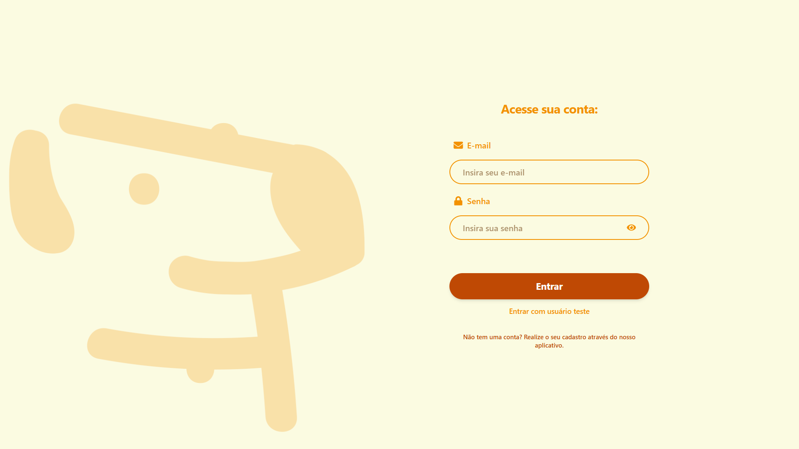
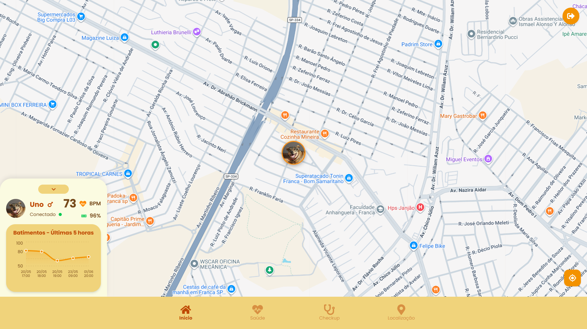
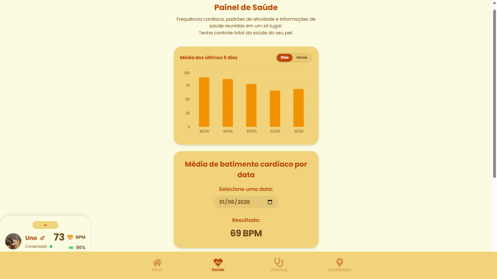
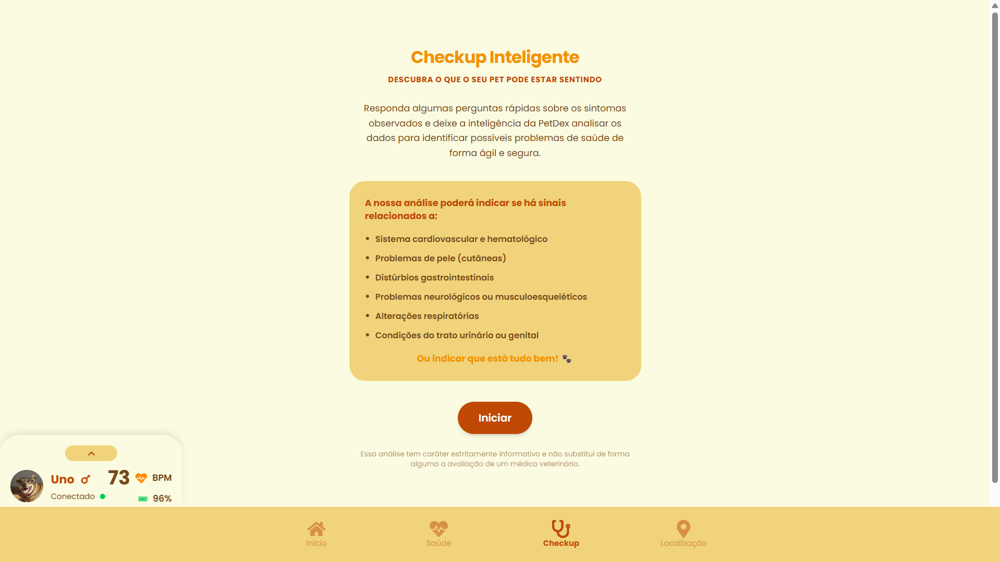
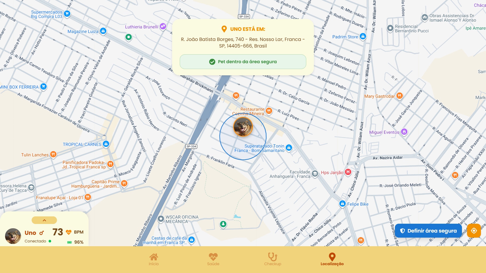

<p align="center">
  
</p>

# 💻 PetDex Web — Painel Web de Monitoramento de Pets

Dashboard administrativo e de usuário desenvolvido em **Next.js** e **React** para monitoramento em tempo real da saúde, localização e segurança de cães e gatos através da coleira inteligente PetDex.

---

## 📋 Pré-requisitos

Antes de começar, certifique-se de ter instalado em sua máquina:

### **Ferramentas Essenciais**

* **Node.js** (versão 20.0 ou superior recomendada)
  - [Download do Node.js](https://nodejs.org/)
  - Verifique a instalação: `node --version` e `npm --version`

* **Git** para clonar o repositório
  - [Download do Git](https://git-scm.com/downloads)

* **Editor de código** (escolha um):
  - [Visual Studio Code](https://code.visualstudio.com/) + Extensões recomendadas (ESLint, Tailwind CSS IntelliSense)

---

## 🚀 Como Executar o Projeto Localmente

### **1. Clone o Repositório**

```bash
git clone https://github.com/FatecFranca/DSM-P4-G07-2025-1.git
cd DSM-P4-G07-2025-1/web
```

### **2. Configure as Variáveis de Ambiente**

Crie um arquivo `.env.local` na raiz da pasta `web` (você pode copiar as configurações padrão abaixo):

```bash
# No Windows PowerShell:
New-Item .env.local -ItemType File
```

Edite o arquivo `.env.local` e configure as chaves de API e URLs do servidor:

```env
# URLs das APIs do Servidor (Google Cloud - Produção)
NEXT_PUBLIC_JAVA_API_URL=http://34.24.9.134:8080
JAVA_API_URL=http://34.24.9.134:8080
NEXT_PUBLIC_API_PYTHON_URL=http://34.24.9.134:8083

# Chave de API do Google Maps para carregar o mapa interativo
NEXT_PUBLIC_GOOGLE_MAPS_API_KEY=SUA_CHAVE_API_GOOGLE_MAPS_AQUI

# URL do WebSocket (para comunicação e telemetria em tempo real)
NEXT_PUBLIC_WEBSOCKET_URL=http://34.24.9.134:8080/ws-petdex
```

**Variáveis de Ambiente Disponíveis:**

| Variável | Descrição | Exemplo Padrão |
|:---------|:----------|:---------------|
| `NEXT_PUBLIC_JAVA_API_URL` | URL pública da API Java (Spring Boot) | `http://34.24.9.134:8080` |
| `NEXT_PUBLIC_API_PYTHON_URL` | URL pública da API Python (FastAPI/IA) | `http://34.24.9.134:8083` |
| `NEXT_PUBLIC_GOOGLE_MAPS_API_KEY` | Chave de API ativa do Google Maps JavaScript API | `SUA_CHAVE_API_AQUI` |
| `NEXT_PUBLIC_WEBSOCKET_URL` | Endpoint de conexão do WebSocket do PetDex | `http://34.24.9.134:8080/ws-petdex` |

---

### **3. Instale as Dependências**

Instale os pacotes necessários especificados no `package.json`:

```bash
npm install
```

---

### **4. Execute em Modo de Desenvolvimento**

Inicie o servidor local de desenvolvimento do Next.js:

```bash
npm run dev
```

O dashboard estará disponível no endereço: **[http://localhost:3000](http://localhost:3000)**.

---

### **5. Compilação para Produção (Build local)**

Para buildar a aplicação otimizada para produção localmente:

```bash
# Compilar o código
npm run build

# Iniciar o servidor com a build otimizada
npm run start
```

---

## 🐳 Executando com Docker

O projeto possui um arquivo `Dockerfile` multi-stage altamente otimizado para produção.

### **1. Buildar a Imagem Docker**

Para gerar a imagem localmente, passando as variáveis de ambiente necessárias para a compilação estática do Next.js:

```bash
docker build \
  --build-arg NEXT_PUBLIC_JAVA_API_URL=http://34.24.9.134:8080 \
  --build-arg NEXT_PUBLIC_API_PYTHON_URL=http://34.24.9.134:8083 \
  --build-arg NEXT_PUBLIC_GOOGLE_MAPS_API_KEY=SUA_CHAVE_API_GOOGLE_MAPS_AQUI \
  --build-arg NEXT_PUBLIC_WEBSOCKET_URL=http://34.24.9.134:8080/ws-petdex \
  -t petdex-web .
```

### **2. Rodar o Container**

Inicie a aplicação na porta `8082` (porta interna exposta no Dockerfile):

```bash
docker run -d -p 8082:8082 --name petdex-web-app petdex-web
```

Acesse o painel no navegador através de: **[http://localhost:8082](http://localhost:8082)**.

---

## 🔑 Acesso de Teste (Henrique)

Para testar todas as funcionalidades integradas com dados simulados e reais de telemetria sem precisar de uma coleira física ativa em mãos, utilize o botão de login rápido ou insira as credenciais abaixo:

### **🔑 Credenciais de Teste**

```json
{
  "email": "henriquealmeidaflorentino@gmail.com",
  "senha": "senha123"
}
```

* **Botão "Entrar com usuário teste":** Localizado abaixo do botão principal "Entrar" na tela de login. Ele preenche e autentica instantaneamente as credenciais do Henrique, permitindo acesso imediato ao painel administrativo.

---

## 💻 Funcionalidades do Dashboard Web

O painel Web oferece uma visualização expandida e gerencial das informações do Pet, dividida em módulos especializados:

### **🔑 Tela de Login**
* Tela com design responsivo (split-screen em telas grandes, com ilustração integrada no fundo).
* Campo de senha interativo com ícone de visualização ("olhinho") para ocultar ou exibir o texto digitado.
* Atalho para login rápido com o usuário de teste, livre de sublinhados, garantindo uma interface polida.

### **🗺️ Tela inicial com Mapa e barra de status**
* **Localização em Tempo Real:** Mapa interativo carregado com a API oficial do Google Maps, mostrando a posição exata do Pet selecionado.
* **WebSocket Stomp Integration:** Conectado diretamente à fila do servidor de mensagens para receber coordenadas GPS atualizadas instantaneamente sem necessidade de refresh.
* **Barra Lateral de Status:** Permite alternar rapidamente entre diferentes animais de estimação do usuário e exibe dados essenciais da coleira (bateria, conectividade).
* **Botão de Logout Dedicado:** Disponível exclusivamente nesta tela de mapa, posicionado de forma flutuante no canto superior direito em cor de destaque com ícone branco, garantindo fácil acesso ao encerramento da sessão.

### **❤️ Painel Analítico de Saúde**
* **Métricas em Tempo Real:** Exibição da última frequência cardíaca registrada da coleira.
* **Gráficos de Telemetria (Recharts):** Gráficos interativos em tempo real detalhando os batimentos cardíacos das últimas 5 horas.
* **Módulos Estatísticos:** Visualização de dados descritivos como Média, Moda, Mediana e Desvio Padrão das pulsações diárias.
* **Detecção de Anomalias:** Probabilidade calculada de batimentos atípicos baseado nas análises da API Python.

### **🩺 Checkup de Sintomas com IA**
* **Questionário Interativo:** Perguntas direcionadas com botões de Sim/Não para registrar anomalias de comportamento detectadas no pet.
* **Previsão de Enfermidades:** Interface conectada à inteligência artificial do PetDex que estima a probabilidade de condições com base nos sintomas.
* **Direcionamento Preventivo:** Recomendações imediatas de cuidados e alertas para procurar atendimento veterinário profissional.

### **📍Área Segura**
* Interface integrada para visualização do perímetro de segurança configurado para cada pet.
* Cartões dinâmicos de status informando se o pet está seguro em casa ou fora dos limites delimitados.

---

## 🖼️ Capturas de Tela da Interface

Aqui estão as capturas de tela da versão Web do PetDex:

### **1. Tela de Login**
<p align="center">
  
</p>

---

### **2. Tela inicial com Mapa e barra de status**
<p align="center">
  
</p>

---

### **3. Painel Analítico de Saúde (Gráficos e Estatísticas)**
<p align="center">
  
</p>

---

### **4. Checkup Inteligente (Previsão de Enfermidades com IA)**
<p align="center">
  
</p>

---

### **5. Tela de Localização (Área Segura no Mapa)**
<p align="center">
  
</p>

---

## 🗂️ Estrutura Arquitetural do Projeto

```
web/
├── app/                        # Roteamento e Estrutura Principal do Next.js (App Router)
│   ├── api/                    # Rotas de integração interna de API
│   ├── globals.css             # Estilos globais e tokens do sistema de design (Tailwind CSS v4)
│   ├── layout.tsx              # Componente de layout base e fonte Google Poppins
│   └── page.tsx                # Ponto de entrada padrão (renderiza o AppShell)
├── components/                 # Componentes React da Aplicação
│   ├── layout/
│   │   └── AppShell.tsx        # Shell principal com abas de navegação e controle de sessão
│   ├── screens/
│   │   ├── CheckupScreen/      # Questionário de sintomas com IA
│   │   ├── HealthScreen/       # Gráficos com Recharts e estatísticas de batimentos
│   │   ├── LocationScreen/     # Monitoramento e gerenciamento de áreas seguras
│   │   ├── LoginScreen/        # Login com toggle de visibilidade e acesso de teste
│   │   └── MapScreen/          # Mapa interativo com Google Maps e logout flutuante
│   └── ui/                     # Componentes de UI modulares e estilizados
│       ├── Button.tsx          # Botões padrão com estilos do tema
│       ├── Input.tsx           # Inputs estilizados e controle de senha
│       ├── NavBar.tsx          # Menu lateral/inferior de abas
│       ├── StatusBar.tsx       # Barra de status com dados de perfil integrados
│       └── ...                 # Outros cards, botões e modais de UI
├── public/                     # Recursos estáticos e imagens
│   └── images/                 # Ilustrações e capturas de tela (cao-dex.png, uno.png)
├── services/                   # Camada de Comunicação com APIs externas
│   ├── httpClient.ts           # Cliente de requisições unificado
│   ├── authService.ts          # Gerenciamento de tokens JWT e sessões
│   ├── animalService.ts        # Busca e listagem dos animais cadastrados
│   ├── animalStatsService.ts   # Estatísticas de saúde e históricos
│   ├── websocketService.ts     # Configuração e streaming via Stomp & SockJS
│   └── ...                     # Serviços auxiliares de mapa e cerca virtual
├── Dockerfile                  # Arquivo de build de produção Docker em multi-stage
├── package.json                # Dependências, scripts e metadados do projeto
└── tsconfig.json               # Configurações estritas do compilador TypeScript
```

---

## 🛠️ Tecnologias Utilizadas

* **Next.js 16+ & React 19** — Framework web moderno com App Router e hooks de ciclo de vida avançados.
* **TypeScript** — Tipagem estática estrita em toda a aplicação garantindo 100% de segurança em compilação.
* **Tailwind CSS v4** — Utilitários e motor CSS avançado integrado diretamente com variáveis nativas do CSS (`@theme`).
* **Google Maps API (@react-google-maps/api)** — Renderização de mapas com marcadores e cercas interativas.
* **Recharts** — Biblioteca premium de construção de gráficos vetoriais SVG, responsiva e interativa.
* **SockJS & StompJS** — Canal bidirecional WebSocket estável para recebimento de coordenadas dinâmicas da coleira.

---

## 📞 Suporte e Contato

1. Garanta que o arquivo `.env.local` está configurado corretamente com a chave do Google Maps e as portas do servidor de produção.
2. Certifique-se de que os servidores Java e Python estão rodando no endereço `34.24.9.134` para comunicação de dados em tempo real.
3. Para mais informações acadêmicas e técnicas, consulte as documentações associadas no repositório principal.

---

> **PetDex Web** — Cuidando do seu pet através de dashboards inteligentes e conectividade em tempo real! 🐾📊
